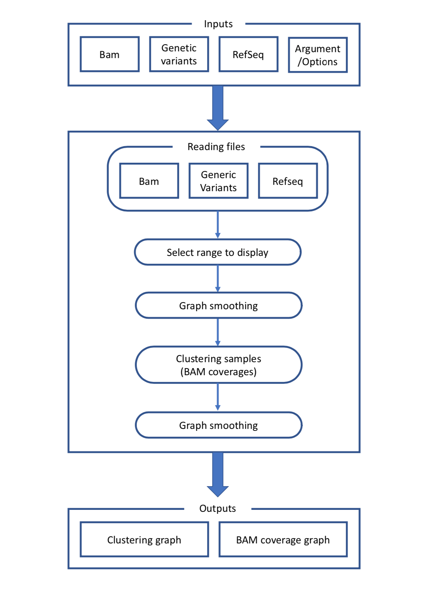

Visbam
======

.. meta::
   :description lang=ko: Visualize coverages of multiple bam files

Visbam은 여러 Bam file들의 coverage를 계산하여 visualize하여 줍니다.
주요 기능은 다음과 같습니다.

Coverage Visualize
    여러 Bam파일들의 Coverage를 계산 후 하나의 Line plot으로 표현합니다.
    계산 후 결과를 Caching하여 한번 계산한 후에는
    더욱 빠르게 결과를 볼 수 있습니다.

Refseq Visualize
    Bam파일의 Coverage가 선택한 DNA의 어느 위치에 있는지 알기 쉽도록
    Coverage 계산 결과 하단에 Refseq Data를 토대로
    Exon정보 등을 표시합니다.

Sample Clustering
    Bam파일들을 Coverage의 계산 결과에 따라 두 그룹으로 나누어 줍니다.
    각 그룹은 붉은색과 초록색으로 표시됩니다.
    알고리즘을 선택하고 설정을 바꾸어 최적의 결과를 표시할 수 있습니다.
    현재 3가지 알고리즘을 지원하고 있습니다.

Inputs
------

Visbam을 실행시키려면 여러 Input이 필요합니다.
필수로 넣어야 하는 Positional Input와 선택 옵션인 Optional Input이 있습니다.
Optional Input 중에서도 특정 Option을 입력할 시
필수로 입력해야 하는 필드가 있으니 주의하시기 바랍니다.
전체 명령어의 목록은 다음과 같습니다.

.. code:: 
   visualize_0123.py [-h] [--exon_sliced] [--curated_genes CURATED_GENES]
   [--exclude_exon EXCLUDE_EXON] [--combine_slices]
   [--draw_average_line] [--draw_span DRAW_SPAN]
   [--smoothing SMOOTHING] [--average AVERAGE] [--fill]
   [--font_size FONT_SIZE] [--marker_size MARKER_SIZE]
   [--ylim YLIM] [--exon_space EXON_SPACE] [--min_max]
   [--clustering] [--clustering_mode CLUSTERING_MODE]
   [--select_exon SELECT_EXON] [--threshold THRESHOLD]
   [--score_plot_width SCORE_PLOT_WIDTH]
   [--score_plot_height SCORE_PLOT_HEIGHT]
   [--limit_tau LIMIT_TAU]
   [--limit_tau_low LIMIT_TAU_LOW]
   [--silhouette_dintv SILHOUETTE_DINTV] [--train TRAIN]
   [--test TEST]
   bam_dir_path sample_list_path normal_dir_path
   refseq_path variants_dir_path nmid_to_draw
   output_prefix

더 자세한 설명은 아래 문서를 참고하십시오.

* :doc:`Positional Arguments <input/positional>`
* :doc:`Optional Arguments <input/optional>`

.. toctree::
   :maxdepth: 2
   :hidden:
   :caption: Inputs

   input/positional
   input/optional

Process
--------

Visbam의 실행 프로세스와 알고리즘을 적어 놓은 문서입니다.
전체적인 과정을 정리하면 아래와 같습니다.

    전체적인 Visbam Process 요약도

각 단계별로 개별적으로 문서를 정리하였습니다.

* :doc:`Reading Files <process/read_files>`
* :doc:`Select Range to Display <process/select_range>`
* :doc:`Smoothing the Graph <process/smoothing>`
* :doc:`Clustering Samples <process/clustering>`
* :doc:`Drawing the Final Graph <process/draw_graph>`

.. toctree::
   :maxdepth: 2
   :hidden:
   :caption: Process

   process/read_files
   process/select_range
   process/smoothing
   process/clustering
   process/draw_graph

Outputs
--------

Visbam의 출력 결과를 정리한 문서입니다.
Clustering 과정에서 제공하는 중간 결과 그래프와
최종적으로 그려지는 Coverage의 Line Plot이 있습니다.
단계별로 나올 수 있는 Output들을 따로 정리하였습니다.

* :doc:`Result of Clustering <output/clustering>`
* :doc:`Final Graph <output/graph>`

.. toctree::
   :maxdepth: 2
   :hidden:
   :caption: Outputs

   output/clustering
   output/graph
