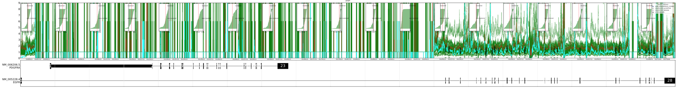
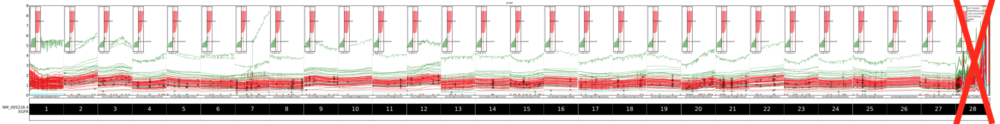
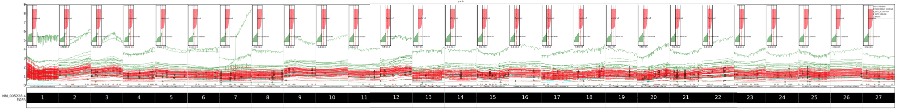
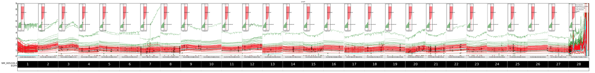
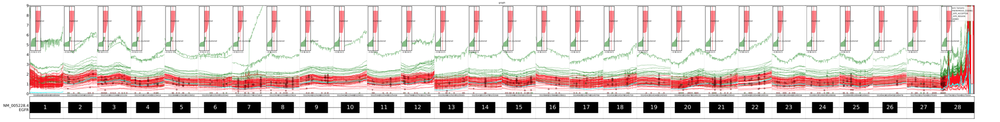
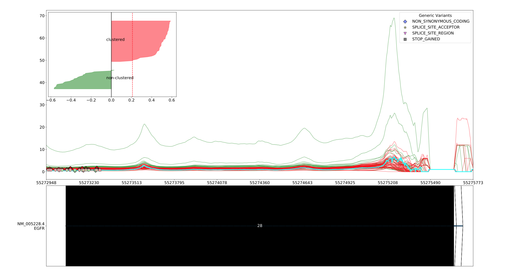
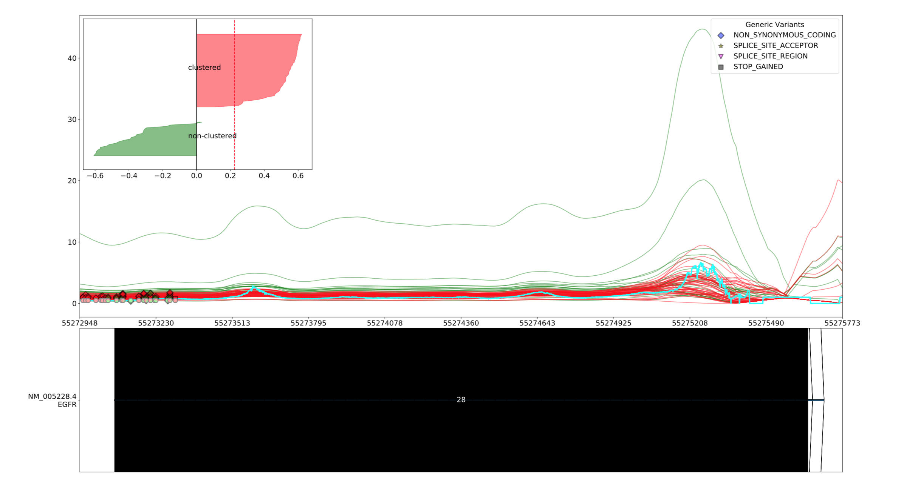
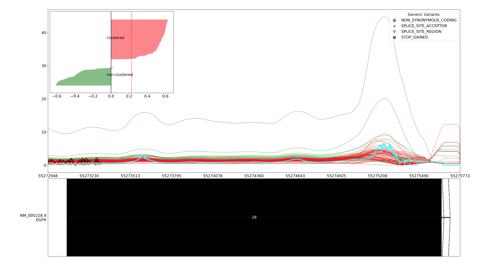

Optional arguments
==================

Visbam의 Optional arguments를 정리해 놓은 문서입니다.
각 option의 기능별로 Drawing graph, Smoothing, Clustering 으로 분류하였습니다.

Drawing graph
-------------

그래프를 그리는 것과 관련된 option들입니다.

combine_slices
~~~~~~~~~~~~~~

.. figure::  ../img/combined_graph.png
    :align: center
    :figwidth: 100%

.. code::

   --combine_slices

Exon별로, 혹은 각 bp별로 나눠진 graph들을 합쳐주는 옵션입니다.
합쳤을 때와 그렇지 않을 떄의 차이는 Final_Graph_ 에서 확인할 수 있습니다.

.. _Final_Graph: https://visbam.readthedocs.io/en/latest/output/graph.html

curated_genes
~~~~~~~~~~~~~~

.. code::

   --curated_genes <curated_genes>

RefSeq_ 데이터 중 ``<curated_genes>`` 파일 목록에 있는 NMID의 RefSeq_ 데이터만 표시합니다.
``<curated_genes>`` 파일은 TSV_ 형식으로 column에 ``RefSeq`` 항목이 포함되어 있어야 합니다.

.. _RefSeq : https://en.wikipedia.org/wiki/RefSeq

.. _TSV : https://en.wikipedia.org/wiki/Tab-separated_values

draw_average_line
~~~~~~~~~~~~~~~~~

.. figure:: ../img/draw_average_line.png
    :align: center
    :figwidth: 100%

    --draw_average_line 적용시 나타나는 average line(붉은색)

.. code::

   --draw_average_line

전체 샘플의 bp별 평균을 붉은색 line plot으로 표시합니다.

draw_span
~~~~~~~~~

.. note::

    이 옵션을 이용하려면 exon_sliced_ 옵션이 비활성화되어야 합니다.

.. code::

   --draw_span <draw_span>

옵션 중 exon_sliced_ 가 활성화 되지 않았을 때,
그래프를 나눌 bp의 크기를 정합니다.
설정되지 않을 시 기본값은 10000입니다.

.. _exon_sliced : https://visbam.readthedocs.io/en/latest/input/optional.html#exon-sliced

exclude_exon
~~~~~~~~~~~~~

.. note::

    이 옵션을 이용하려면 exon_sliced_ 옵션이 활성화되어야 합니다.

    원본

    \\-\\-exclude_exon 28 을 적용한 결과

.. code::

   --exclude_exon <exclude_exon>

일부 exon을 제외하고 표시합니다.
Exon을 여러개를 선택하려면 쉼표로 구분하여 표시합니다.

예 :

.. code::

    --exclude_exon 1,2,3

.. _exon_sliced : https://visbam.readthedocs.io/en/latest/input/optional.html#exon-sliced

exon_sliced
~~~~~~~~~~~

.. code::

   --exon_sliced

이 옵션을 켤 시, exon별로 그래프를 그릴 구간을 나누게 됩니다.
그렇지 않으면, draw_span_ 에 따라 나누게 됩니다. 
각 그래프의 차이는 (링크)에서 확인할 수 있습니다.

.. _draw_span: positional.html#draw-span

exon_space
~~~~~~~~~~~

.. note::

    이 옵션을 이용하려면 exon_sliced_ 옵션이 활성화되어야 합니다.

    엑손 사이의 간격을 30bp로 두어 출력한 모습

.. code::

   --exon_space <exon_space>

exon_sliced_ 옵션에서 exon 앞뒤의 간격을 bp_ 단위로 설정하여 줍니다.
int값을 받습니다.

.. _exon_sliced : https://visbam.readthedocs.io/en/latest/input/optional.html#exon-sliced
.. _bp : https://en.wikipedia.org/wiki/Base_pair

font_size
~~~~~~~~~~

.. code::

   --font_size <font_size>

폰트 크기를 설정합니다. 자연수 값을 받으며 단위는 pt입니다.

marker_size
~~~~~~~~~~~

.. code::

   --marker_size <marker_size>

`Genetic variants`_ 를 visualize할 때 marker의 크기를 조정합니다.
자연수 값을 받으며 단위는 pt입니다.

.. _`Genetic variants` : https://en.wikipedia.org/wiki/Genetic_variant

min_max
~~~~~~~

.. figure:: ../img/min_max.png
    :align: center
    :figwidth: 100%

    --min_max를 적용했을 떄 그래프

.. code::

   --min_max

그래프의 position 별 최댓값과 최솟값을 각각 이어 line plot으로 그린 뒤,
사이를 투명하게 채워 그래프를 표시합니다.

ylim
~~~~

.. code::

   --ylim <ylim>

그래프를 표시할 coverage의 최댓값을 설정합니다.
자연수 값을 받습니다.
이 옵션이 없으면 모든 sample의 coverage 중
제일 높은 값으로 설정됩니다.

Smoothing
---------

그래프를 smoothing하는 것과 관련된 option들입니다.

smoothing
~~~~~~~~~~

.. code::

   --smoothing <smoothing>

어떤 속성으로 smoothing을 할 지 설정합니다.
설정할 수 있는 속성은 다음과 같습니다.

* ``average``

* ``loess``

Smoothing 속성에 대한 자세한 정보는 Smoothing_ 을 참조하십시오.

.. _Smoothing: https://visbam.readthedocs.io/en/latest/process/smoothing.html 

average
~~~~~~~~

    average 10

    average 100

.. note::

    이 옵션을 이용하려면 smoothing_ 옵션이 ``average`` 이어야 합니다.

.. code::

   --average <average>

Smoothing이 ``average`` 일 때, average를 적용할 앞 뒤 bp_ 간격을 설정합니다.
자연수 값을 받습니다.
``<average>`` 가 1이면, 앞과 뒤에 각각 1 bp_ 가 적용되어 계산됩니다.

.. _bp : https://en.wikipedia.org/wiki/Base_pair

fill
~~~~~

.. note::

    이 옵션을 이용하려면 smoothing_ 옵션이 ``average`` 이어야 합니다.

    average 100 fill

.. code::

   --fill

Smoothing이 ``average`` 일 때, 앞 뒤로 average_ 만큼 간격을 더 주어
그 간격에서 Moving average를 계산합니다.

Clustering
---------

Sample들을 clustering하는 것과 관련된 option들입니다.

clustering
~~~~~~~~~~

.. code::

   --clustering

주어진 샘플을 두 그룹으로 clustering_ 합니다.

.. note::

    아래 옵션을 이용하려면 clustering 옵션이 활성화 되어있어야 합니다.

.. _clustering: https://visbam.readthedocs.io/en/latest/process/clustering.html 

clustering_mode 
~~~~~~~~~~~~~~~

.. code::

   --clustering_mode <clustering_mode>

Clustering을 진행할 알고리즘을 결정합니다.
알고리즘은 각각 ``silhouette`` , ``nmf`` , ``splice_site`` 가 있습니다.
각 알고리즘에 대해서는 Clustering_Samples_ 문서를 참조하십시오.

.. warning::

    위 3개에 해당하지 않는 값을 입력할 시 에러가 뜨고 프로그램이 종료됩니다.

.. _Clustering_Samples: https://visbam.readthedocs.io/en/latest/process/clustering.html 

select_exon
~~~~~~~~~~~

.. code::

   --select_exon <select_exon>

Clustering의 기준이 될 두 exon의 번호를 입력합니다.

.. note::

    Exon의 번호는 아래와 같이 입력합니다.

    예 :

    .. code::

        1번과 7번 exon을 지정하고 싶다면
        -> --select_exon 1,7

score_plot_width
~~~~~~~~~~~~~~~~

.. note::

    이 옵션을 이용하려면 clustering_mode_ 옵션이 ``silhouette`` 이어야 합니다.

.. code::

   --score_plot_width <score_plot_width>

Silhouette 최적화 과정에서 중간 결과로 그려지는
CI/Tau/Score plot의 width를 결정합니다.
단위는 inch이고 자연수 값을 받습니다.
CI/Tau/Score plot에 대해서는 Result_of_Clustering_ 문서를 참조하십시오.

.. _Result_of_Clustering: https://visbam.readthedocs.io/en/latest/output/clustering.html

score_plot_height
~~~~~~~~~~~~~~~~~

.. note::

    이 옵션을 이용하려면 clustering_mode_ 옵션이 ``silhouette`` 이어야 합니다.

.. code::

   --score_plot_height <score_plot_height>

Silhouette 최적화 과정에서 중간 결과로 그려지는
CI/Tau/Score plot의 height를 결정합니다.
단위는 inch이고 자연수 값을 받습니다.

limit_tau
~~~~~~~~~~

.. note::

    이 옵션을 이용하려면 clustering_mode_ 옵션이 ``silhouette`` 이어야 합니다.

.. code::

   --limit_tau <limit_tau>

Silhouette 최적화 과정에서 tau의 위쪽 limit를 결정합니다.
자연수 값을 받습니다.

limit_tau_low
~~~~~~~~~~~~~

.. note::

    이 옵션을 이용하려면 clustering_mode_ 옵션이 ``silhouette`` 이어야 합니다.

.. code::

   --limit_tau_low <limit_tau_low>

Silhouette 최적화 과정에서 tau의 아래쪽 limit를 결정합니다.
자연수 값을 받습니다.

silhouette_dintv
~~~~~~~~~~~~~~~~

.. note::

    이 옵션을 이용하려면 clustering_mode_ 옵션이 ``silhouette`` 이어야 합니다.

.. code::

   --silhouette_dintv <silhouette_dintv>

Silhouette Clustering 과정에서 계산할 exon 앞뒤의 간격을 조정합니다.
단위는 bp이고 자연수 값을 받습니다.

