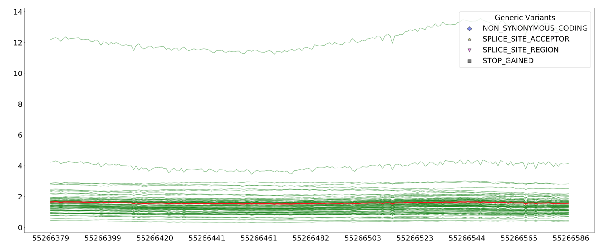
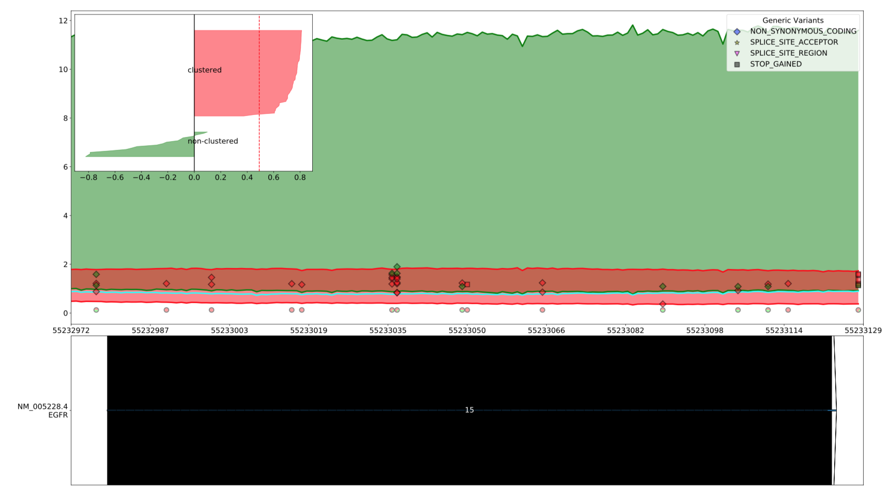

Optional Arguments
==================

Optional Arguments를 정리해 놓은 문서입니다.
Visbam에 필요한 유용한 기능들이 많이 있습니다.
대부분 필수적으로 적어야 하지 않지만, 특정 Option에 따라
설정해줘야 하는 Input들도 있으니 참조하시기 바랍니다.
각 Option이 담당하는 기능별로 모았습니다.

Drawing Graph
-------------

그래프를 그리는 것과 관련된 Option들입니다.

combine_slices
~~~~~~~~~~~~~~

엑손별로, 혹은 각 bp별로 나눠진 graph들을 합쳐주는 옵션입니다.
합쳤을 때와 그렇지 않을 떄의 차이는 Final_Graph_에서 확인할 수 있습니다.

.. _Final_Graph: https://visbam.readthedocs.io/en/latest/output/graph.html

curated_genes
~~~~~~~~~~~~~~

.. note::

    이 옵션을 이용하려면 소스 코드와 같은 폴더 내에
    tsv형식으로 되어 있는 ``allCuratedGenes.txt`` 파일이 있어야 합니다.
    ``allCuratedGenes.txt`` 에 대해서는 Reading_Files_ 를 참조하시기 바랍니다.

Refseq 데이터 중 allCuratedGenes.txt에 포함되어 있는 Refseq 데이터만 표시합니다.

.. _Reading_Files: https://visbam.readthedocs.io/en/latest/process/read_files.html#refseq

draw_average_line
~~~~~~~~~~~~~~~~~

전체 샘플의 bp별 평균을 붉은색 Line Plot으로 표시합니다.

    draw_average_line 적용시 나타나는 average line(붉은색)

exclude_exon
~~~~~~~~~~~~~

.. note::

    이 옵션을 이용하려면 ``exon_sliced`` 옵션이 활성화되어야 합니다.

일부 엑손을 제외하고 표시합니다.
엑손을 여러개를 선택하려면 쉼표로 구분하여 표시합니다.

예 :

.. code::

    --exclude_exon 1,2,3

exon_sliced
~~~~~~~~~~~

이 옵션을 켤 시, exon별로 그래프를 그릴 구간을 나누게 됩니다.
그렇지 않으면, draw_span_ 에 따라 나누게 됩니다. 
각 그래프의 차이는 (링크)에서 확인할 수 있습니다.

.. _draw_span: positional.html#draw-span

exon_space
~~~~~~~~~~~

.. note::

    이 옵션을 이용하려면 ``exon_sliced`` 옵션이 활성화되어야 합니다.

``exon_sliced`` 옵션에서 exon 앞뒤의 간격을 bp단위로 설정하여 줍니다.

font_size
~~~~~~~~~~

폰트 크기를 설정합니다. 단위는 pt입니다.

marker_size
~~~~~~~~~~~

Generic Variants를 Visualize할 때 Marker의 크기를 조정합니다.
단위는 pt입니다.

min_max
~~~~~~~

    --min_max를 적용했을 떄 그래프

그래프의 Position별 최댓값과 최솟값을 각각 이어 Line Plot으로 그린 뒤,
사이를 투명하게 채워 그래프를 표시합니다.

ylim
~~~~

그래프를 표시할 Coverage의 최댓값을 설정합니다.
이 옵션이 없으면 모든 Sample의 Coverage 중
제일 높은 값으로 설정됩니다.

Smoothing
---------

그래프를 Smoothing하는 것과 관련된 Option들입니다.

smoothing
~~~~~~~~~~

어떤 속성으로 Smoothing을 할 지 설정합니다.
설정할 수 있는 속성은 다음과 같습니다.

* ``average``

* ``loess``

Smoothing 속성에 대한 자세한 정보는 Smoothing_ 을 참조하십시오.

.. _Smoothing: https://visbam.readthedocs.io/en/latest/process/smoothing.html 

average
~~~~~~~~

.. note::

    이 옵션을 이용하려면 ``smoothing`` 옵션이 ``average`` 이어야 합니다.

Smoothing이 average일 때, average를 적용할 앞 뒤 bp간격을 설정합니다.
average가 1이면, 앞과 뒤에 각각 1bp가 적용되어 계산됩니다.

fill
~~~~~

.. note::

    이 옵션을 이용하려면 ``smoothing`` 옵션이 ``average`` 이어야 합니다.

Smoothing이 average일 때, 앞 뒤로 ``average`` 만큼 간격을 더 주어
그 간격에서 Moving Average를 계산합니다.

Clustering
---------

Sample들을 Clustering하는 것과 관련된 Option들입니다.

clustering
~~~~~~~~~~

주어진 샘플을 두 그룹으로 Clustering 합니다.

.. note::

    아래 옵션을 이용하려면 ``clustering`` 옵션이 활성화 되어있어야 합니다.

clustering_mode 
~~~~~~~~~~~~~~~

Clustering을 진행할 알고리즘을 결정합니다.
알고리즘은 각각 ``silhouette`` , ``nmf`` , ``splice_site`` 가 있습니다.
각 알고리즘에 대해서는 Clustering_Samples_ 문서를 참조하십시오.

.. warning::

    위 3개에 해당하지 않는 값을 입력할 시 에러가 뜨고 프로그램이 종료됩니다.

.. _Clustering_Samples: https://visbam.readthedocs.io/en/latest/process/clustering.html 

select_exon
~~~~~~~~~~~

Clustering을 진행할 두 엑손의 번호를 입력합니다.

.. note::

    Exon의 번호는 아래와 같이 입력합니다.

    예 :

    .. code::

        1번과 7번 exon을 지정하고 싶다면
        -> --select_exon 1,7

threshold
~~~~~~~~~~

Clustering 된 그룹 중 평균이 threshold 이상인 값을 제외합니다.

score_plot_width
~~~~~~~~~~~~~~~~

.. note::

    이 옵션을 이용하려면 ``clustering_mode`` 옵션이 ``silhouette`` 이어야 합니다.

Silhouette 최적화 과정에서 중간 결과로 그려지는
CI/Tau/Score Plot의 Width를 결정합니다.
단위는 inch입니다.
CI/Tau/Score Plot에 대해서는 Result_of_Clustering_ 문서를 참조하십시오.

.. _Result_of_Clustering: https://visbam.readthedocs.io/en/latest/output/clustering.html

score_plot_height
~~~~~~~~~~~~~~~~~

.. note::

    이 옵션을 이용하려면 ``clustering_mode`` 옵션이 ``silhouette`` 이어야 합니다.

Silhouette 최적화 과정에서 중간 결과로 그려지는
Score Plot의 height를 결정합니다.
단위는 inch입니다.

limit_tau
~~~~~~~~~~

.. note::

    이 옵션을 이용하려면 ``clustering_mode`` 옵션이 ``silhouette`` 이어야 합니다.

Silhouette 최적화 과정에서 tau의 위쪽 limit를 결정합니다.

limit_tau_low
~~~~~~~~~~~~~

.. note::

    이 옵션을 이용하려면 ``clustering_mode`` 옵션이 ``silhouette`` 이어야 합니다.

Silhouette 최적화 과정에서 tau의 아래쪽 limit를 결정합니다.

silhouette_dintv
~~~~~~~~~~~~~~~~

.. note::

    이 옵션을 이용하려면 ``clustering_mode`` 옵션이 ``silhouette`` 이어야 합니다.

Silhouette Clustering 과정에서 계산할 Exon 앞뒤의 간격을 조정합니다.
단위는 bp입니다.

