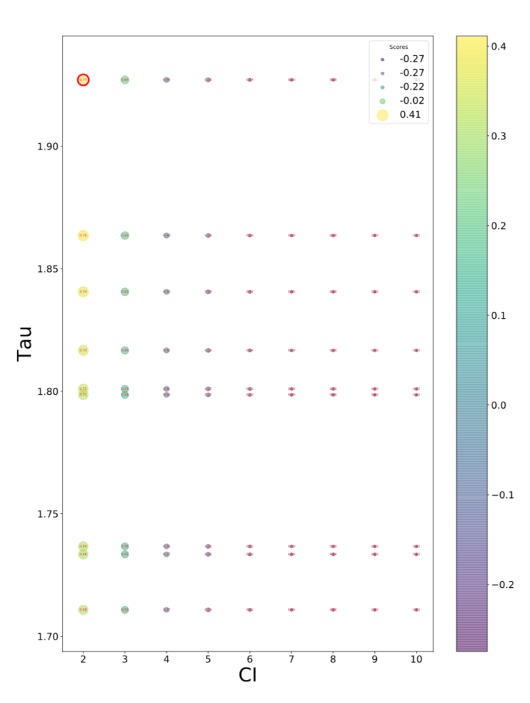
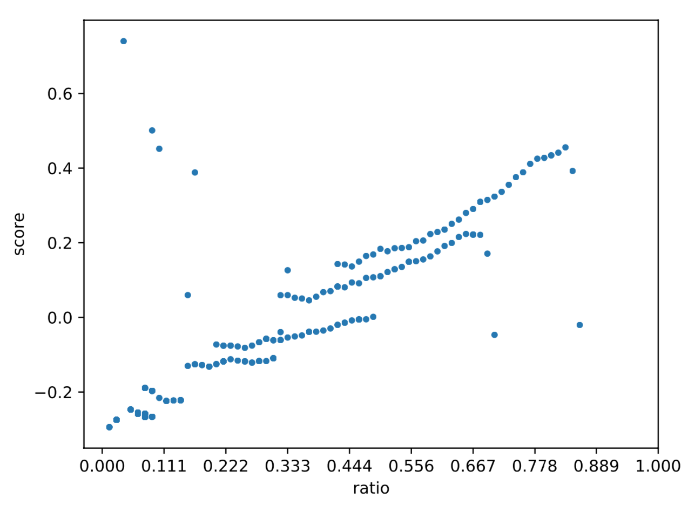

Result of clustering
====================

Clustering 과정에서 출력된 결과물에 대해서 설명합니다.
현재 clustering 과정 중 Silhouette 과정만 별도의 출력을 하고 있습니다.

CI/Tau/Score scatter plot
-------------------------

CI(Confidence Interval), Tau에 따른 score의 관계를 표시한 그래프 입니다.
Scatter plot으로 출력되었고, x축은 Ci, y축은 Tau입니다.

Plot의 크기가 score의 크기 입니다.
우측 상단에 있는 legend로 score가 어느 정도 크기인지 표시하였습니다.
또, plot의 색 또한 score의 크기에 따라 다릅니다.
오른쪽 color bar를 통해 score의 크기를 알 수 있습니다.
그리고 plot에 중앙에 있는 숫자는 두 그룹 중 clutering 된 그룹의 비율입니다.
선택된 부분에 대한 plot에는 빨간색 테두리로 강조 표시를 하였습니다.

이 그래프의 width와 height는
`\\-\\-score_plot_width`_, `\\-\\-score_plot_height`_ 로 지정할 수 있습니다.

.. _\\-\\-score_plot_width : https://visbam.readthedocs.io/en/latest/input/optional.html#score-plot-width

.. _\\-\\-score_plot_height : https://visbam.readthedocs.io/en/latest/input/optional.html#score-plot-height

Ratio/Score scatter plot
------------------------

Clustering 된 것과 그렇지 않은 것 사이의 비율(ratio)를 x축으로 하고,
score를 y축으로 하여 표시한 scatter plot 그래프 입니다.

