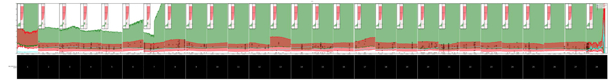
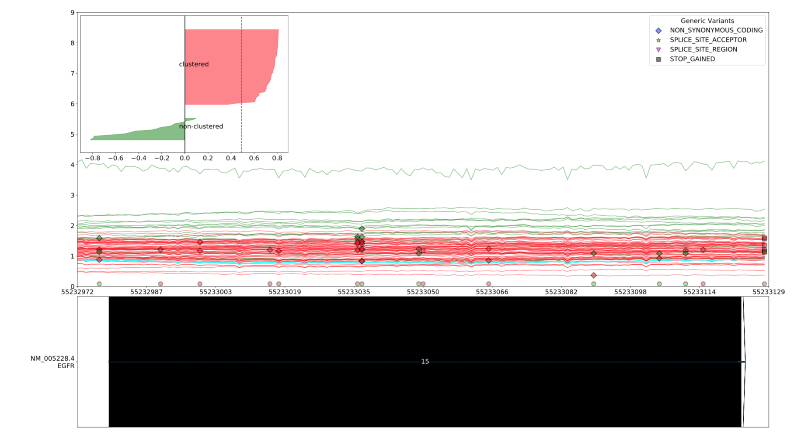
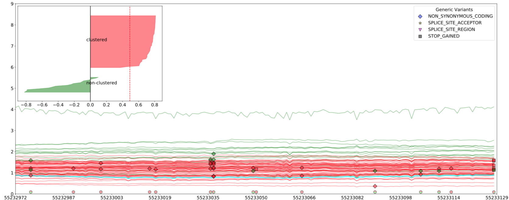
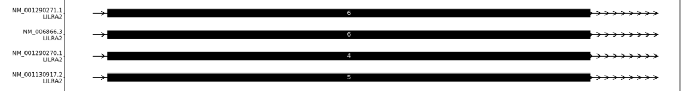

Final Graph
==========

최종 결과물 그래프에 대해서 설명을 하는 페이지입니다.

``--combined_slices`` 옵션이 켜져 있을 시 하나의 PDF로 출력됩니다.

그렇지 않으면 각 Slice별로 출력됩니다.

그래프는 크게 Coverage 부분, Refseq 부분으로 나누어집니다.
Coverage부분에서는 Sample별로 계산한 Coverage들을 표시합니다.
Refseq부분에서는 불러온 Refseq을 전부 표시합니다.

Coverage
--------

최종적으로 계산한 Coverage를 표시하는 부분입니다.
여기에 Generic Variants도 함께 표시됩니다.

Coverage는 Line Plot으로 그려집니다.
Clustering을 하지 않을 시 모든 그래프가 반투명한 초록색으로 그려집니다.
Clustering을 할 시에는 그래프가 빨간색, 초록색 두 그룹으로 나뉘어져 그려집니다.

Clustering을 할 시 각 Slice별로 좌측 상단에 Clustering Evaluation 그래프를 표시합니다.
Clustering Evaluation은 Silhouette Score 기반으로 그려지며 값은 각각 -1 이상입니다.
또 두 그룹으로 나누어서 해당하는 Group의 색으로 표시하여 줍니다.

Coverage Line Plot 위에 Generic Variants를 표시합니다.
각 Generic Variants의 Effect 별로 모양이 달라집니다.
모양이 어떤 Effect를 의미하는 지는 우측 상단에 Legend를 통해서 확인 할 수 있습니다.
또 색은 Generic Variants의 Bam이 어떤 Group에 Clustering 되었는지에 따라 달라집니다.

그리고 그래프 하단에 Generic Variants가 존재하는 Position에 한해
Position별로 Pie Graph가 표시됩니다.
어떤 Group의 Bam의 Generic Variants가 그 Position에 있는지 한 눈에 확인할 수 있습니다.

Refseq
------

선택된 Refseq들을 Coverage 부분의 Position에 따라 표시해 줍니다.
tx, cds와 direction, exon을 그려줍니다.

tx, cds
~~~~~~~

tx, cds 부분은 Refseq의 시작과 끝을 표시합니다.

direction
~~~~~~~~~

Direction은 해당 Refseq의 전사 방향을 표시하여 줍니다.
Left면 왼쪽, Right면 오른쪽으로 화살표 모양으로 표시됩니다.

exon
~~~~

Exon은 넓은 직사각형 모양으로 표시됩니다.
Exon의 중앙에 각 Exon의 번호를 표시합니다.
