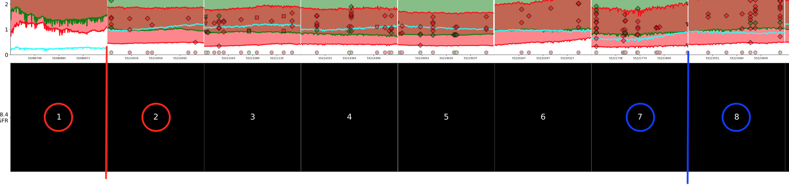

Clustering Samples
==================

Sample을 두 그룹으로 Clustering 하는 Process입니다.
Clustering 알고리즘은 3가지가 있습니다.
``silhouette``, ``nmf``, ``splice_site`` 입니다.

Silhouette
----------

silhouette는 Coverage값에 따른 Exon의 앞쪽 Position의 오차범위에
뒤쪽 Position의 평균이 들어가지 않을 때 이를 Clustering 하는 과정입니다.

Clustering을 할 때, Exon을 두 개 선택하게 됩니다.
아래 설명을 위해 ``Exon 1`` 과
``Exon 7`` 을 선택했다고 가정합시다.

선택한 첫번째 Exon은 ``Exon 1`` 입니다.
``Exon 1`` 과 ``Exon 2`` 를 붙여서 보면,
Exon의 경계에서 Coverage 그래프 간의 차이가 생기게 됩니다.

이 때 ``Exon 1`` 의 끝에서 ``silhouette_dintv`` 만큼의 구간의
``CI`` 신뢰구간을 구해줍니다.
``Exon 2`` 의 시작에서 ``silhouette_dintv`` 만큼의 구간의
전체 평균이 이 ``CI`` 신뢰구간에 들어가지 않으면, Clustering 합니다.

또, ``Exon 8`` 의 끝에서 ``silhouette_dintv`` 만큼의 구간의
``CI`` 신뢰구간을 구해줍니다.
``Exon 7`` 의 시작에서 ``silhouette_dintv`` 만큼의 구간의
전체 평균이 이 ``CI`` 신뢰구간에 들어가지 않으면, Clustering 합니다.
두 조건을 모두 만족해야 Clustering이 됩니다.

``Exon 2`` 의 평균을 ``Tau`` 로 설정합니다.
이보다 작은 값들만 최종 Clustering하게 됩니다.

위에서 ``CI`` 와 ``Tau`` 값을 조정하면서 Silhouette Score를 측정합니다.
그 중 Silhouette Score가 가장 높을 때, 최종 Clustering 결과로 결정합니다.

NMF
---

NMF를 이용하여 Exon의 시작과 끝 앞뒤로 ``interval`` 을 둔 범위의
Coverage 값을 모든 Sample에 대해 불러옵니다.
이 값을 NMF(Non-nefative matrix factorization)을 이용하여 W와 H 행렬로 나눕니다.
W와 H행렬의 각각 행과 열은 2로 나누어 줍니다.
이때 W행은 Sample 만큼의 행과 2열로 구성됩니다.
해당 Sample의 행에서 0번째 열보다 1번째 열이 더 클 경우 Clustering합니다.

이 때, ``interval`` 에 따라 이 과정을 반복하며 Silhouette Score를 계산합니다.
``interval`` 중, 제일 높은 Silhouette Score를 받은 ``interval`` 과
Clustering 결과를 저장하고 이를 NMF의 Clustering 결과로 합니다.

Splice_Site
-----------

Generic Variants 데이터 중 Effect의 이름이 ``splice_site`` 가
있는 것들을 모아 줍니다.
Splice_Site가 있는 Sample을 모두 선택하여 Clustering 하여 줍니다.
