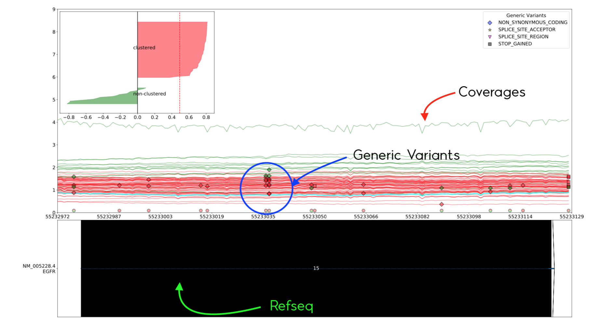

Drawing the Final Graph
=======================

최종 Final Graph를 출력하는 과정입니다.
이전 과정에서 계산했던 Smoothing 된(또는 그렇지 않은) Coverage,
Generic Variants, Refseq 값을 이용하여 그래프에 표시합니다.

그래프는 `--combine_slices`_  값의 활성화 여부에 따라 한 파일로 출력될 지
여러 파일로 출력될 지 결정됩니다.

Output 그림에 관한 자세한 설명은 Outputs_ 문서를 참조하십시오.

.. _Outputs: https://visbam.readthedocs.io/en/latest/output/graph.html

.. _--combine_slices_ : https://visbam.readthedocs.io/en/latest/input/optional.html#combine-slices

Coverages
---------

먼저 Sample들을 Line Plot으로 표시하여 줍니다.
Clustering이 진행되지 않은 경우 모든 Sample이 초록색으로 표시됩니다.
Clustering이 진행 된 경우, Clustering 된 Sample은 빨간색으로 표시됩니다.

그리고 해당 Clustering이 얼마나 잘 되었는지 확인할 수 있는
Clustering Evaluation 그래프를 각 Exon별로 그려줍니다.

Generic Variants
----------------

Generic Variants를 일치하는 Sample과 Position에 표시하여 줍니다.
그리고 Effect 별로 다른 모양을 표시하여 줍니다.

또 그래프 하단에 Variant가 존재하는 Position에 한해
Clustering 된 두 그룹의 비율을 Pie Marker로 표시하여 줍니다.

Refseq
-------

그래프 하단에 Refseq를 표시하여줍니다.
Reading Files과정에서 불러왔던 Refseq들을 모두 아래쪽 하단에 표시합니다.

