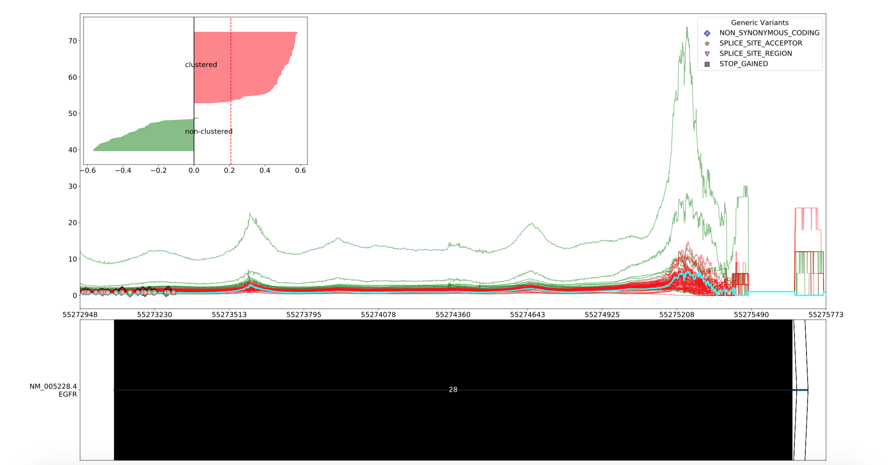
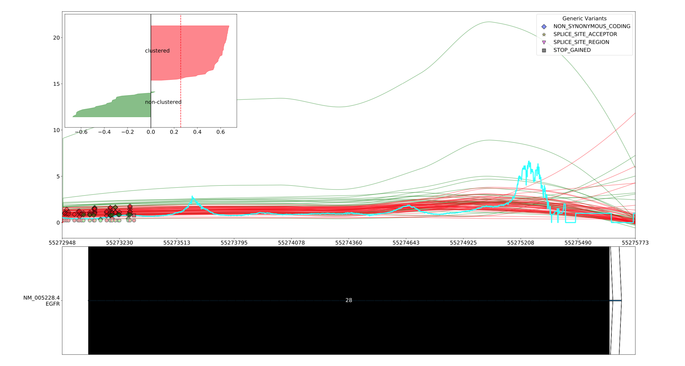

Smoothing the graph
===================

그래프를 더 간단히 볼 수 있도록 smoothing 하는 과정입니다.
Smoothing은 두 가지 알고리즘을 선택하여 진행합니다.
``average`` 와 ``loess`` 입니다.

    원본 그래프

Average
-------

.. figure::  ../img/smoothing_average_10.png
    :align: center
    :figwidth: 100%
    :target: ../img/smoothing_average_10.png

    Average가 10 일 때 그래프

.. figure::  ../img/smoothing_average_100.png
    :align: center
    :figwidth: 100%
    :target: ../img/smoothing_average_100.png

    Average가 100 일 때 그래프

Average_ 는 각 position 앞 뒤로 `\\-\\-average`_ 간격 만큼의 평균을
계산하여 그 값을 구하는 방식으로 smoothing을 합니다.

.. figure::  ../img/smoothing_average_100_fill.png
    :align: center
    :figwidth: 100%
    :target: ../img/smoothing_average_100_fill.png

    Average가 100 일 때 fill option을 켠 그래프

이 때 해당 position 앞뒤로 `\\-\\-average`_ 만큼의 값이 없는
position의 경우에는 그 값이 0으로 처리됩니다.
`\\-\\-fill`_ 옵션을 켜 exon 앞뒤의 값을 더 불러온 뒤 처리할 수 있습니다.

.. _Average : https://en.wikipedia.org/wiki/Moving_average
.. _\\-\\-average : https://visbam.readthedocs.io/en/latest/input/optional.html#average
.. _\\-\\-fill : https://visbam.readthedocs.io/en/latest/input/optional.html#fill

Loess
------

    Loess 그래프

Loess_ 는 skmisc의 loess라이브러리를 이용하여 smoothing하는 방식입니다.
자세한 방식은 skmisc_ 를 참조하십시오.

.. _Loess : https://en.wikipedia.org/wiki/Local_regression
.. _skmisc: https://has2k1.github.io/scikit-misc/loess.html
